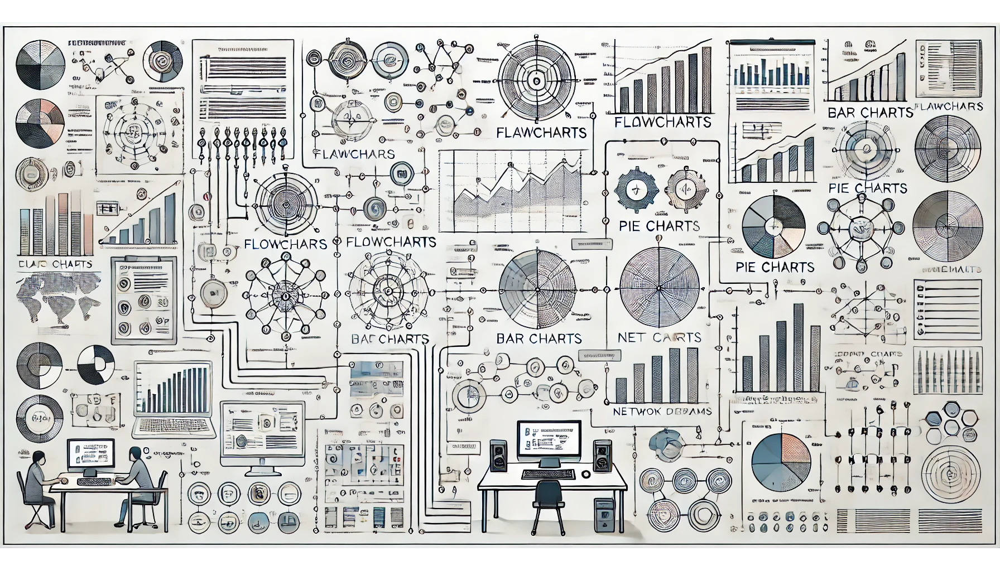
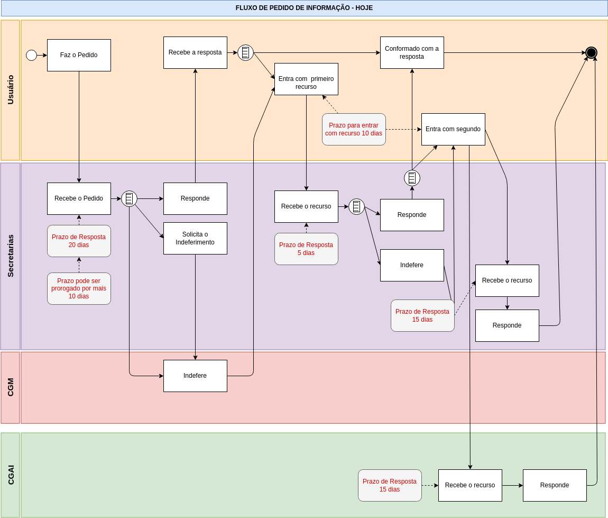
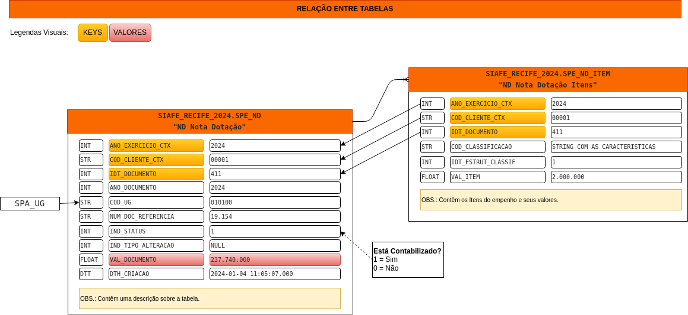
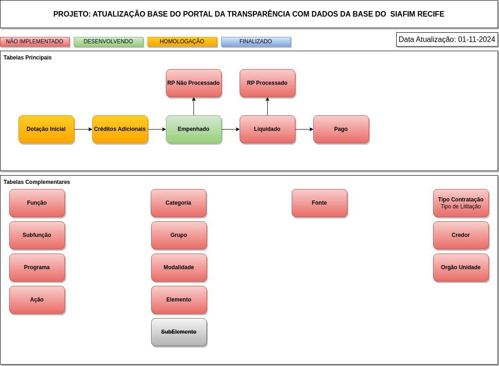

# Exemplos de Diagramas

 

## Descrição do Repositório

Este é um repositório de diagramas para modelagem de processos e software, sendo uma coleção estruturada de recursos visuais projetados para facilitar a criação, análise e comunicação de fluxos de trabalho, arquiteturas e sistemas.

 

## Diagrama de Atividade [Personalizado]

Esta na pasta: "diagramas_atividade"

 

## Diagramas para Banco de Dados [Personalizados]

Esta na pasta: "banco_de_dados"

## Diagrama para Gestão [Personalizado]

Esta na pasta: "gestao_processos"

## Objetivo

Facilitar o desenvolver de mapeamento de processos e aplicações.

 

## Equipe:

<table border="1px" style="width: 100%">
   <thead>
      <tr>
         <th style="width: 30%; text-align: center; background-color: #d6d3d1;">Nome</th>
         <th style="width: 20%; text-align: center; background-color: #d6d3d1;">Celular</th>
         <th style="width: 20%; text-align: center; background-color: #d6d3d1;">E-mail</th>
         <th style="width: 30%; text-align: center; background-color: #d6d3d1;">Função</th>
      </tr>
   </thead>
   <tbody>
      <tr>
            <td>Rafael Freitas Lima</td>
            <td>(81) 98834-1541</td>
            <td>rafael.freitas@recife.pe.gov.br</td>
            <td>Desenvolvedor</td>
      </tr>
   </tbody>
</table>

 

# Tecnologias Utilizadas
   - Ferramenta Visual:
      - Draw.io Integration v1.6.6 Henning Dieterichs (Extensão do VSCode)

